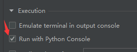
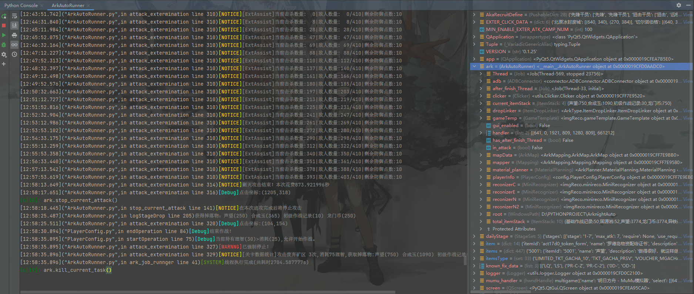
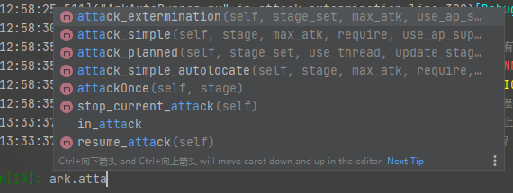

# ArknightsAutoRunner

### 一个基于ide运行的多功能明日方舟战斗脚本

## *0x01 写在前面：

> A. 本项目的核心最初是基于我的另一个项目(痒痒鼠)的全自动脚本重构开发而来，并借鉴了烧包大大 [ArknightsAutoHelper](https://github.com/ninthDevilHAUNSTER/ArknightsAutoHelper)
> 中基于字体的OCR识别方式作为作战地图编号识别，其余部分则基于图像匹配算法。  
> B. 本项目于2020年10开始动工，如今由于某些原因，并且项目本身也较为完整因此暂时搁置一段时间，具体何时继续增加新的功能
> 未知，不过在新活动更新后我也会及时上传新的地图路由数据保证自动作战能够顺利进行 ~~如果我没更新也可以在群里call我~~。  
> C. mitm辅助正在开发中，由于和本工程可以形成配合并且需要本工程大量api作为支撑，后期我可能会将mitm和本项目置于同一工程内，
> 但是由于当前mitm涉及到一些工程问题暂时无法上传，希望大家理解。  
> D. 本程序目前仅支持IDE运行(即:使用命令行模式打开ArkAutoRunner.py并通过python指令的方式运行，如PyCharm的Python Console或VS Code的IPython)或自行编写脚本逻辑。
> 并且仅支持Mumu模拟器使用720P分辨率(1280x720)并且不允许最小化游戏窗口(但是可以被其他窗口覆盖或放在其他桌面[win10])

## *0x02 我能用这个程序做什么？
设置多个关卡的战斗规划(包括活动和素材关！)然后运行；连续开启剿灭作战；夜间结束作战后设置自动休眠计算机；计算公开招募并自动收取&开启公招；访问好友基建并获取信赖商店；收取每日任务奖励...以及更多api与自定义设置！
### 下面是部分输出信息详情
#### 战斗信息
```
[01:01:47.459]("ADBConnector.py",in touch_tap line 288)[Debug]点击坐标:(789,451)
[01:01:48.910]("ADBConnector.py",in touch_tap line 288)[Debug]点击坐标:(805,457)
[01:01:52.251]("PlayerConfig.py",in endOperation line 84)[Debug]结束作战！
[01:01:52.251]("PlayerConfig.py",in startOperation line 75)[Debug]当前持有理智(121)>消耗(6),允许开始作战。
[01:01:52.262]("ArkAutoRunner.py",in attack_simple line 472)当前实际理智(122/134),预测理智(122),开始行动(第3次/共AUTO次)。
[01:01:52.262]("ArkAutoRunner.py",in attack_simple line 474)[Debug]点击坐标:(1158,653)
[01:01:53.307]("ArkAutoRunner.py",in <lambda> line 481)[Debug]点击坐标:(1107,514)
[01:03:06.369]("ArkAutoRunner.py",in attack_simple line 486)[Debug]等待结束，开始检测通关信息。
[01:03:15.406]("ArkAutoRunner.py",in attack_simple line 495)行动结束,本次花费81.43秒
[01:03:22.542]("ArkAutoRunner.py",in logStageDrop line 205)获得掉落物：基础作战记录(1) 固源岩(1) 声望(72) 龙门币(72)
[01:03:22.569]("ADBConnector.py",in touch_tap line 288)[Debug]点击坐标:(793,470)
[01:03:23.966]("ADBConnector.py",in touch_tap line 288)[Debug]点击坐标:(794,479)
[01:03:27.320]("PlayerConfig.py",in endOperation line 84)[Debug]结束作战！
[01:03:27.320]("PlayerConfig.py",in startOperation line 75)[Debug]当前持有理智(115)>消耗(6),允许开始作战。
[01:03:27.331]("ArkAutoRunner.py",in attack_simple line 472)当前实际理智(116/134),预测理智(116),开始行动(第4次/共AUTO次)。
[01:03:27.331]("ArkAutoRunner.py",in attack_simple line 474)[Debug]点击坐标:(1151,661)
[01:03:28.409]("ArkAutoRunner.py",in <lambda> line 481)[Debug]点击坐标:(1107,526)
[01:04:41.626]("ArkAutoRunner.py",in attack_simple line 486)[Debug]等待结束，开始检测通关信息。
[01:04:50.670]("ArkAutoRunner.py",in attack_simple line 495)行动结束,本次花费81.47秒
[01:04:57.825]("ArkAutoRunner.py",in logStageDrop line 205)获得掉落物：基础作战记录(2) 固源岩(1) 声望(72) 龙门币(72) 源岩(1)
[01:04:57.857]("ADBConnector.py",in touch_tap line 288)[Debug]点击坐标:(804,481)
[01:04:59.293]("ADBConnector.py",in touch_tap line 288)[Debug]点击坐标:(787,457)
[01:05:02.650]("PlayerConfig.py",in endOperation line 84)[Debug]结束作战！
```
#### 停止战斗
```
ark.stop_current_attack()
[12:58:18.445]("ArkAutoRunner.py",in stop_current_attack line 141)[NOTICE]在本次进攻完成后将停止攻击
[12:58:25.487]("ArkAutoRunner.py",in logStageDrop line 205)获得掉落物：声望(250) 合成玉(365) 初级作战记录(10) 龙门币(250)
[12:58:25.511]("ArkAutoRunner.py",in attack_extermination line 320)[Debug]点击坐标:(104,154)
[12:58:30.894]("PlayerConfig.py",in endOperation line 84)[Debug]结束作战！
[12:58:35.895]("PlayerConfig.py",in startOperation line 75)[Debug]当前持有理智(30)>消耗(25),允许开始作战。
[12:58:35.895]("ArkAutoRunner.py",in attack_extermination line 327)[WARNNG]已强制停止！
```
#### 剿灭作战
```
[12:43:37.965]("PlayerConfig.py",in startOperation line 75)[Debug]当前持有理智(53)>消耗(25),允许开始作战。
[12:43:37.976]("ArkAutoRunner.py",in attack_extermination line 266)[NOTICE]当前合成玉数量为1090,最大合成玉获取数量为1800,还可获取710合成玉
[12:43:37.977]("ArkAutoRunner.py",in attack_extermination line 274)当前实际理智(79/135),开始行动(第3次/共3次)。
[12:43:37.977]("ArkAutoRunner.py",in attack_extermination line 275)[Debug]点击坐标:(1146,662)
[12:43:39.059]("ArkAutoRunner.py",in <lambda> line 285)[Debug]点击坐标:(1095,511)
[12:43:51.742]("ArkAutoRunner.py",in attack_extermination line 310)[NOTICE][ExtAssist]当前击杀数量:  0|敌人数量:  0/410|剩余防御点数:10
[12:44:31.840]("ArkAutoRunner.py",in attack_extermination line 310)[NOTICE][ExtAssist]当前击杀数量:  8|敌人数量:  8/410|剩余防御点数:10
[12:45:11.984]("ArkAutoRunner.py",in attack_extermination line 310)[NOTICE][ExtAssist]当前击杀数量: 28|敌人数量: 28/410|剩余防御点数:10
[12:45:52.075]("ArkAutoRunner.py",in attack_extermination line 310)[NOTICE][ExtAssist]当前击杀数量: 47|敌人数量: 47/410|剩余防御点数:10
[12:46:32.164]("ArkAutoRunner.py",in attack_extermination line 310)[NOTICE][ExtAssist]当前击杀数量: 69|敌人数量: 69/410|剩余防御点数:10
[12:47:12.227]("ArkAutoRunner.py",in attack_extermination line 310)[NOTICE][ExtAssist]当前击杀数量: 88|敌人数量: 88/410|剩余防御点数:10
[12:47:52.313]("ArkAutoRunner.py",in attack_extermination line 310)[NOTICE][ExtAssist]当前击杀数量:110|敌人数量:112/410|剩余防御点数:10
[12:48:32.397]("ArkAutoRunner.py",in attack_extermination line 310)[NOTICE][ExtAssist]当前击杀数量:137|敌人数量:140/410|剩余防御点数:10
[12:49:12.498]("ArkAutoRunner.py",in attack_extermination line 310)[NOTICE][ExtAssist]当前击杀数量:161|敌人数量:166/410|剩余防御点数:10
[12:49:52.576]("ArkAutoRunner.py",in attack_extermination line 310)[NOTICE][ExtAssist]当前击杀数量:180|敌人数量:185/410|剩余防御点数:10
[12:50:32.663]("ArkAutoRunner.py",in attack_extermination line 310)[NOTICE][ExtAssist]当前击杀数量:197|敌人数量:203/410|剩余防御点数:10
[12:51:12.727]("ArkAutoRunner.py",in attack_extermination line 310)[NOTICE][ExtAssist]当前击杀数量:213|敌人数量:219/410|剩余防御点数:10
[12:51:52.816]("ArkAutoRunner.py",in attack_extermination line 310)[NOTICE][ExtAssist]当前击杀数量:225|敌人数量:231/410|剩余防御点数:10
[12:52:32.904]("ArkAutoRunner.py",in attack_extermination line 310)[NOTICE][ExtAssist]当前击杀数量:241|敌人数量:247/410|剩余防御点数:10
[12:53:12.986]("ArkAutoRunner.py",in attack_extermination line 310)[NOTICE][ExtAssist]当前击杀数量:261|敌人数量:269/410|剩余防御点数:10
[12:53:53.102]("ArkAutoRunner.py",in attack_extermination line 310)[NOTICE][ExtAssist]当前击杀数量:272|敌人数量:280/410|剩余防御点数:10
[12:54:33.175]("ArkAutoRunner.py",in attack_extermination line 310)[NOTICE][ExtAssist]当前击杀数量:290|敌人数量:298/410|剩余防御点数:10
[12:55:13.259]("ArkAutoRunner.py",in attack_extermination line 310)[NOTICE][ExtAssist]当前击杀数量:312|敌人数量:322/410|剩余防御点数:10
[12:55:53.358]("ArkAutoRunner.py",in attack_extermination line 310)[NOTICE][ExtAssist]当前击杀数量:340|敌人数量:350/410|剩余防御点数:10
[12:56:33.440]("ArkAutoRunner.py",in attack_extermination line 310)[NOTICE][ExtAssist]当前击杀数量:351|敌人数量:361/410|剩余防御点数:10
[12:57:13.542]("ArkAutoRunner.py",in attack_extermination line 310)[NOTICE][ExtAssist]当前击杀数量:378|敌人数量:388/410|剩余防御点数:10
[12:57:53.619]("ArkAutoRunner.py",in attack_extermination line 310)[NOTICE][ExtAssist]当前击杀数量:393|敌人数量:403/410|剩余防御点数:10
[12:58:13.649]("ArkAutoRunner.py",in attack_extermination line 314)[NOTICE]剿灭攻击结束！本次花费873.921996秒
```
#### 获取掉落记录
```
ark.getDropInfoHistory('DM-8')
[22:01:01.538]("ArkAutoRunner.py",in log line 902)[NOTICE][DropInfoHistory] 关卡DM-8物品掉落信息 总155次攻击被统计 单次攻击消耗理智:18
[22:01:01.538]("ArkAutoRunner.py",in log line 902)[NOTICE][DropInfoHistory] 物品名称        | 数量   | 平均概率  | 期望理智 | 附加信息
[22:01:01.539]("ArkAutoRunner.py",in log line 902)[NOTICE][DropInfoHistory] 无名的识别牌　　　| 2790  | 18      |     1.0 | 主要掉落
[22:01:01.539]("ArkAutoRunner.py",in log line 902)[NOTICE][DropInfoHistory] 异铁组　　　　　　| 107   | 69.0%   |   26.07 | 主要掉落
[22:01:01.541]("ArkAutoRunner.py",in log line 902)[NOTICE][DropInfoHistory] 龙门币　　　　　　| 33480 | 216     |    0.08 |
[22:01:01.541]("ArkAutoRunner.py",in log line 902)[NOTICE][DropInfoHistory] 声望　　　　　　　| 33480 | 216     |    0.08 |
[22:01:01.542]("ArkAutoRunner.py",in log line 902)[NOTICE][DropInfoHistory] ---------------------------------------------------
[22:01:01.543]("ArkAutoRunner.py",in log line 902)[NOTICE][DropInfoHistory] [MainDrop][I] 主要掉落物内容       |  次数  |  比例
[22:01:01.544]("ArkAutoRunner.py",in log line 902)[NOTICE][DropInfoHistory] [MainDrop][0] {无名的识别牌:18,异铁组:1} |    107 | 69.03%
[22:01:01.545]("ArkAutoRunner.py",in log line 902)[NOTICE][DropInfoHistory] [MainDrop][1] {无名的识别牌:18}  |     48 | 30.97%
```
#### 公开招募
```
ark.planRecruit(force=1)
[22:03:05.843]("ArkAutoRunner.py",in run_withThr line 186)[NOTICE]线程开始运行
Out[23]: True
[22:03:05.875]("ArkAutoRunner.py",in planRecruit line 529)[Debug]点击坐标:(995,512)
[22:03:08.521]("ArkAutoRunner.py",in planRecruit line 534)[Debug]{'id': 0, 'type': 'FINISH', 'centre': [325.0, 307.0], 'can': False}
[22:03:08.521]("ArkAutoRunner.py",in planRecruit line 534)[Debug]{'id': 1, 'type': 'READY', 'centre': [958.0, 307.0], 'can': True}
[22:03:08.522]("ArkAutoRunner.py",in planRecruit line 534)[Debug]{'id': 2, 'type': 'READY', 'centre': [325.0, 586.0], 'can': True}
[22:03:08.522]("ArkAutoRunner.py",in planRecruit line 534)[Debug]{'id': 3, 'type': 'READY', 'centre': [958.0, 586.0], 'can': True}
[22:03:08.523]("ArkAutoRunner.py",in planRecruit line 542)[Debug]点击坐标:(329,386)
[22:03:13.457]("ArkAutoRunner.py",in planRecruit line 545)[Debug]点击坐标:(1218,51)
[22:03:16.978]("ArkAutoRunner.py",in planRecruit line 552)[Debug]点击坐标:(1232,144)
[22:03:18.670]("ArkAutoRunner.py",in planRecruit line 554)选择第1个公招,当前force=1
[22:03:18.670]("ArkAutoRunner.py",in planRecruit line 556)[Debug]点击坐标:(323,308)
[22:03:20.094]("ArkAutoRunner.py",in planRecruitSingle line 595)获取标签:['术师干员', '远程位', '费用恢复', '输出', '群攻']用时0.050秒
[22:03:20.102]("ArkAutoRunner.py",in planRecruitSingle line 600)建议刷新本次公开招募
[22:03:20.103]("ArkAutoRunner.py",in _select_recruit_tag line 617)[Debug]点击坐标:(970,411)
[22:03:21.262]("ArkAutoRunner.py",in _select_recruit_tag line 618)[Debug]点击坐标:(845,505)
[22:03:24.103]("ArkAutoRunner.py",in planRecruitSingle line 595)获取标签:['特种干员', '先锋干员', '治疗', '费用恢复', '位移']用时0.029秒
[22:03:24.104]("ArkAutoRunner.py",in planRecruitSingle line 603)建议进行招募：选择TagIndex:[0, 4]时间:9H0M
[22:03:24.105]("ArkAutoRunner.py",in _select_recruit_tag line 624)[Debug]点击坐标:(444,380)
[22:03:24.504]("ArkAutoRunner.py",in _select_recruit_tag line 624)[Debug]点击坐标:(611,452)
[22:03:24.881]("ArkAutoRunner.py",in _select_recruit_tag line 626)[Debug]点击坐标:(456,146)
[22:03:25.258]("ArkAutoRunner.py",in _select_recruit_tag line 626)[Debug]点击坐标:(453,158)
[22:03:25.630]("ArkAutoRunner.py",in _select_recruit_tag line 626)[Debug]点击坐标:(447,159)
[22:03:25.995]("ArkAutoRunner.py",in _select_recruit_tag line 626)[Debug]点击坐标:(442,152)
[22:03:26.378]("ArkAutoRunner.py",in _select_recruit_tag line 626)[Debug]点击坐标:(452,142)
[22:03:26.770]("ArkAutoRunner.py",in _select_recruit_tag line 626)[Debug]点击坐标:(448,155)
[22:03:27.147]("ArkAutoRunner.py",in _select_recruit_tag line 626)[Debug]点击坐标:(462,159)
[22:03:27.525]("ArkAutoRunner.py",in _select_recruit_tag line 626)[Debug]点击坐标:(448,148)
[22:03:27.917]("ArkAutoRunner.py",in _select_recruit_tag line 631)[Debug]点击坐标:(975,589)
[22:03:30.804]("ArkAutoRunner.py",in planRecruit line 554)选择第2个公招,当前force=0
[22:03:30.804]("ArkAutoRunner.py",in planRecruit line 556)[Debug]点击坐标:(956,304)
[22:03:32.202]("ArkAutoRunner.py",in planRecruitSingle line 595)获取标签:['医疗干员', '辅助干员', '术师干员', '先锋干员', '生存']用时0.017秒
[22:03:32.203]("ArkAutoRunner.py",in planRecruitSingle line 598)建议跳过本次公开招募
[22:03:32.203]("ArkAutoRunner.py",in _select_recruit_tag line 614)[Debug]点击坐标:(969,641)
[22:03:34.067]("ArkAutoRunner.py",in planRecruit line 554)选择第3个公招,当前force=-1
[22:03:34.067]("ArkAutoRunner.py",in planRecruit line 556)[Debug]点击坐标:(325,576)
[22:03:35.477]("ArkAutoRunner.py",in planRecruitSingle line 595)获取标签:['近卫干员', '医疗干员', '术师干员', '近战位', '远程位']用时0.015秒
[22:03:35.477]("ArkAutoRunner.py",in planRecruitSingle line 598)建议跳过本次公开招募
[22:03:35.478]("ArkAutoRunner.py",in _select_recruit_tag line 614)[Debug]点击坐标:(984,654)
[22:03:37.377]("ArkAutoRunner.py",in planRecruit line 554)选择第4个公招,当前force=-2
[22:03:37.377]("ArkAutoRunner.py",in planRecruit line 556)[Debug]点击坐标:(966,588)
[22:03:38.776]("ArkAutoRunner.py",in planRecruitSingle line 595)获取标签:['近卫干员', '辅助干员', '先锋干员', '近战位', '费用恢复']用时0.020秒
[22:03:38.777]("ArkAutoRunner.py",in planRecruitSingle line 598)建议跳过本次公开招募
[22:03:38.777]("ArkAutoRunner.py",in _select_recruit_tag line 614)[Debug]点击坐标:(981,654)
[22:03:40.658]("ArkAutoRunner.py",in planRecruit line 574)[Debug]点击坐标:(64,49)
[22:03:43.929]("ArkAutoRunner.py",in ark_job_runnger line 41)[SYSTEM]线程执行完成(共耗时38.084779s)
```
#### 收取任务奖励
```
ark.clear_daily_task()
[22:04:16.136]("ArkAutoRunner.py",in run_withThr line 186)[NOTICE]线程开始运行
Out[24]: True
[22:04:17.462]("ArkAutoRunner.py",in clear_daily_task line 666)[Debug]点击坐标:(797,598)
[22:04:19.700]("ArkAutoRunner.py",in _clear_task_reward line 643)[Debug]点击坐标:(62,166)
[22:04:20.711]("ArkAutoRunner.py",in _clear_task_reward line 644)[Debug]点击坐标:(70,162)
[22:04:21.451]("ArkAutoRunner.py",in clear_daily_task line 677)[NOTICE]日常任务剩余识别：['TASK3_1', 'TASK3_0', 'FINISH', 'FINISH', 'FINISH', 'FINISH']
[22:04:21.451]("ArkAutoRunner.py",in clear_daily_task line 678)[Debug]点击坐标:(863,36)
[22:04:22.630]("ArkAutoRunner.py",in _clear_task_reward line 643)[Debug]点击坐标:(62,171)
[22:04:23.629]("ArkAutoRunner.py",in _clear_task_reward line 644)[Debug]点击坐标:(56,171)
[22:04:24.354]("ArkAutoRunner.py",in clear_daily_task line 680)[NOTICE]周常任务剩余识别：['FINISH', 'FINISH', 'FINISH', 'FINISH', 'FINISH', 'FINISH']
[22:04:24.355]("ArkAutoRunner.py",in clear_daily_task line 682)[Debug]点击坐标:(91,39)
[22:04:25.434]("ArkAutoRunner.py",in ark_job_runnger line 41)[SYSTEM]线程执行完成(共耗时9.296677s)
```
## *0x03 需求：

### python 版本 >= 3.8

### Mumu模拟器；并调整至1280x720状态 (设置后请重启mumu，在重启时会自动调整窗口大小，之后请勿手动调整模拟器窗口大小！)

### 像样的IDE(推荐PyCharm，Tab一键补全&全提示真的非常方便)

## *0x04 requirements列表

| 库         | 版本  | 简述|
| ---------- | ----- | ----- |
| PyQt5|~=5.15.1|快速截图与GUI界面库
| opencv-python|~=4.4.0.42|图像处理库
| numpy|~=1.19.1|图像处理库
| pandas|~=1.1.4|
| qimage2ndarray|~=1.8.3|图像处理库
| Pillow|~=7.2.0|图像处理库
| rich|~=9.12.0|命令显示库(mitm/可不装)
| pytesseract|~=0.3.6|OCR处理库
| pywin32|~=228|
| openpyxl|~=3.0.5|

> 你也可以在仓库里找到requirements.txt，并使用pip install -r requirements.txt来快速安装需要的环境。

## *0x05 地图适配说明：

### 当前脚本已完成主线地图完全匹配，并且对于复刻活动地图与新活动地图也会及时进行匹配。

|活动|代号|是否完成匹配|备注|
|----|----|----|----|
|*主线           | *  | 是√
|*剿灭作战        | *  | 是√? | 当前最新匹配:废弃矿区
| 喧闹法则        | CB | 是√
| 骑兵与猎人       | GT | 否x
| 火蓝之心        | OF | 否x
| 战地秘闻        | SW | 否x
| 洪炉示岁        | AF | 否x
| 午间逸话        | SA | 否x
| 生于黑夜        | DM | 是√
| 乌萨斯的孩子们   | SV | 否x
| 沃伦姆德的薄暮   | TW | 否x
| 密林悍将归来     | RI | 否x
| 刻俄柏的灰蕈迷境 | ISW | 否x
| 踏寻往昔之风     | FA | 否x
| 玛莉娅·临光     | MN | 否x
| 孤岛风云        | NB | 是√
| 此地之外        | BH | 否x
| 画中人          | WR | 是√
| 源氏尘行动       | OD | 是√

## *0x06 使用说明:

> ⚠ **不建议从 GitHub 下载 zip 源码包安装**：这样做会丢失版本信息，且无法接收到后续更新，请使用git进行下载！

### 以PyCharm为例，VS Code请安装IPython插件并使用Console模式运行！

将AAR工程克隆到本地
> git clone http://github.com/fexli/ArknightsAutoRunner.git

切换到工程目录
> cd ArknightsAutoRunner

安装库
> pip install -r requirements.txt

安装PyCharm后进入文件资源管理器，切换到工程目录，右键选择
> Open Folder As PyCharm Project


进入PyCharm，先运行一次ArkAutoRunner.py，在默认情况下会是在Run中显示，并快速结束。此时请更改设置  
  
勾选Run With Python Console  
  
运行，在PyCharm下方即可看到Python Console正在运行ArkAutoRunner  
  
键入ark.并按下tab，等待补全框显示  
  
恭喜，你已完成全部的程序初始化，请尽情使用吧~

## *0x07 程序功能:

> 本程序ide集成了许多常用的辅助功能，并通过函数的方式使用多线程进行触发。
> 在您使用函数时会默认使用线程模式进行攻击，其目的是让主线程可以快速返回而不被阻塞，同时不会耽误任务线程正常的运行。
> 在同一时间仅允许一个游戏操作线程/函数/指令运行，并有一个结束后附加运行(用于完成战斗后触发睡眠/关机状态)函数。
> 以下是函数列表，您也可以浏览ArkAutoRunner去查看其它函数及功能。

> ⚠  **以.开头的函数均为ArkAutoRunner(ark)类函数，请使用ark.\<funcname\> 触发函数**

### 基础单关卡作战函数 ark.attack_simple()

```python
def attack_simple(self, stage: str = "AUTO",  # 'AUTO'为自动识别当前位置
                  max_atk: int = -1,  # 最大攻击次数,-1为不限制
                  require: ItemStack = None,  # 需求列表(参见ItemStack)
                  use_ap_supply=True,  # 在没理智时是否使用理智药剂
                  use_diamond=False,  # 在没理智时是否碎石(未完成！慎用！)
                  use_thread=True,  # 使用线程
                  planned_stage=None,  # 为规划作战预留api，请勿单独使用
                  log_drop=True):  # 是否记录掉落物
    pass  # 开启简单作战，请先切换到关卡页面(即：右下角有蓝色开始作战按钮，右上角有理智显示的界面)
```

### 自动切换关卡位置的单一关卡作战函数 ark.attack_simple_autolocate()

```python
def attack_simple_autolocate(self, stage,  # 需要去作战的地图名称(如'1-7')
                             max_atk=-1,  # 最大攻击次数,-1为不限制
                             require=None,  # 需求列表(参见ItemStack)
                             use_ap_supply=True,  # 在没理智时是否使用理智药剂
                             use_diamond=False,  # 在没理智时是否碎石(未完成！慎用！)
                             use_thread=True):  # 使用线程
    pass  # 自动识别当前位置并切换到指定地图，开启作战。
```

### 规划战斗函数 ark.attack_planned()

```python
def attack_planned(self, stage_set,  # 作战规划地图设置(参见StageSet)
                   use_thread=True,  # 使用线程
                   update_stage=False):  # 是否在作战完毕后对作战规划进行更新(请勿对公用作战规划进行更新！否则作战都规划将清空)
    # 是否使用理智、每个关卡攻击次数、总体攻击次数请在StageSet设置
    pass  # 自动识别当前位置并按照顺序自动切换并进攻地图指定次数。
```
### 打一次 ark.attackOnce()
```python
def attackOnce(self, stage=None): # 真就是打一次...
    if stage is None:
        return self.attack_simple(max_atk=1)
    else:
        return self.attack_simple_autolocate(stage, max_atk=1)
```
### 剿灭作战函数 ark.attack_extermination()

```python
def attack_extermination(self, stage_set=None,  # stage_set为剿灭地图对应的中文名称(如'废弃矿区')
                         max_atk=1,  # 攻击次数
                         use_ap_supply=False,  # 在没理智时是否使用理智药剂
                         use_diamond=False,  # 在没理智时是否碎石(未完成！慎用！)
                         use_thread=True,  # 使用线程
                         log_drop=True):  # 记录掉落物
    # 使用ExtAssist辅助显示当前进攻信息
    pass  # 自动切换到剿灭地图并开启剿灭；若不设置stage_set自动切换到最新剿灭地图(详见0x04地图说明)
```
***
### 辅助相关
### 公开招募 ark.planRecruit()
```python
def planRecruit(self, force=0, use_thread=True):
    # force为强制选择几个公开招募
    # 公开招募默认选择顺序为 必出6x>必出5x>必出小车>必出4x>强制选择
    # 若均不满足则会退出或刷新
    # 若需要停止6x的选择，请在ArkTools/ArkRecruitPlanner自行设置！
    pass
```
### 访问好友&清空信用商店 ark.clear_credit_item()
### 收取每日任务和每周任务 ark.clear_daily_task()
### 一键领取邮件内容 ark.clear_mail_item()
***
### 一些常用的功能函数
### ark.stop_current_attack()
在当次攻击结束后停止攻击函数
### ark.resume_attack()
在使用ark.stop_current_attack()后，进攻结束前若想继续下次进攻使用本函数恢复
### ark.kill_current_task()
立即强制停止当前正在运行的操作线程
### ark.restart_adb()
重新启动Python ADB连接(不会杀死adb.exe进程，若出现bug需要结束adb.exe请使用附加指令)
```python
ark.restart_adb(kill=True)
```
### ark.run_after_current()
在本次操作线程结束后运行某个函数，建议使用lambda匿名函数作为参数
```python
ark.run_after_current(lambda: os.system("shutdown -h"))
```
### ark.sleep_computer_after_current_atk()
在当次攻击结束后使用shutdown -h指令让电脑进入休眠模式，函数原理和上面的一样。
### ark.getDropInfoHistory()
在使用本程序攻击时，每次结束战斗后都会保存本次战斗的掉落信息到Drop目录下，同时保存截图到logs目录下，
因此可以通过本函数获取某关的掉落数据
```python
ark.getDropInfoHistory('1-7')
```

## *0x08 后续&关于基建和其他:
> 事先声明一下，我可能在完成mitm前**不会**写基建的相关功能，因为在目前状态下仅凭OCR计算基建内容的效率是较低的，并且由于干员、皮肤、基建技能等原因会大大增加误判率，而我已经完成了隔壁的基于数据的基建干员分析与基建排班系统，并且经过近2个月的运行证明了可行性。
### 关于工程的其他内容，后续我会上传一份其他类的函数API一览，由于在IDE环境中能够方便的查看python运行时变量内容，并且可以实时编写代码并运行，因此也希望大家也能帮助我完善程序 提交pr我会及时查看的~

### 对于任何的疑问或者有任何的问题可以直接提交issue或在ArkAutoHelper交流群(757689154)中找我

#### fexli@2021.4.10